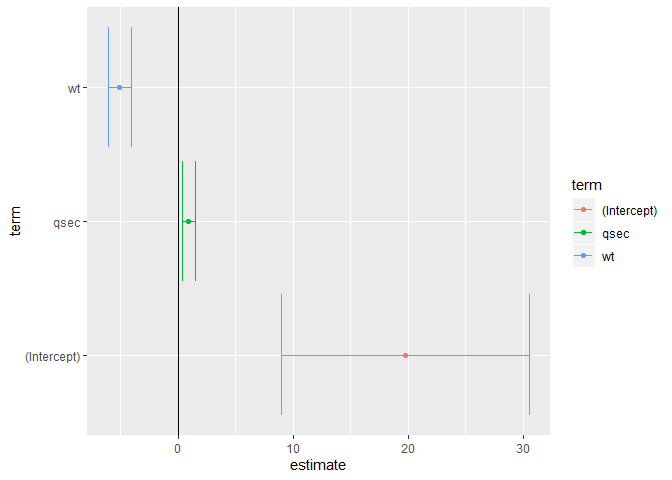

Presentation UN
================

## Objectifs

  - Versionner un modèle de présentation et utiliser xaringan.

  - Inciter les étudiant à regarder plus tôt git, tidyverse et caret.

## To Do

  - Inclure un script d’utilisation du tidyverse / data.table ?

  - Inclure/pointer vers demo de rstudio connect ?

**lm classique** exemple pris de
<http://varianceexplained.org/r/broom-intro/>

``` r
fit <- lm(mpg ~ wt + qsec, mtcars)
summary(fit)
```

    ## 
    ## Call:
    ## lm(formula = mpg ~ wt + qsec, data = mtcars)
    ## 
    ## Residuals:
    ##     Min      1Q  Median      3Q     Max 
    ## -4.3962 -2.1431 -0.2129  1.4915  5.7486 
    ## 
    ## Coefficients:
    ##             Estimate Std. Error t value Pr(>|t|)    
    ## (Intercept)  19.7462     5.2521   3.760 0.000765 ***
    ## wt           -5.0480     0.4840 -10.430 2.52e-11 ***
    ## qsec          0.9292     0.2650   3.506 0.001500 ** 
    ## ---
    ## Signif. codes:  0 '***' 0.001 '**' 0.01 '*' 0.05 '.' 0.1 ' ' 1
    ## 
    ## Residual standard error: 2.596 on 29 degrees of freedom
    ## Multiple R-squared:  0.8264, Adjusted R-squared:  0.8144 
    ## F-statistic: 69.03 on 2 and 29 DF,  p-value: 9.395e-12

**tidy model** permet de rassembler les stats des modèles dans un
data.frame (tidy \~ ranger en anglais).

``` r
suppressPackageStartupMessages( library(broom) )
tidy(fit)
```

    ## # A tibble: 3 x 5
    ##   term        estimate std.error statistic  p.value
    ##   <chr>          <dbl>     <dbl>     <dbl>    <dbl>
    ## 1 (Intercept)   19.7       5.25       3.76 7.65e- 4
    ## 2 wt            -5.05      0.484    -10.4  2.52e-11
    ## 3 qsec           0.929     0.265      3.51 1.50e- 3

Inspecter les performances par observations :

``` r
head(augment(fit))
```

    ## # A tibble: 6 x 11
    ##   .rownames   mpg    wt  qsec .fitted .se.fit  .resid   .hat .sigma .cooksd
    ##   <chr>     <dbl> <dbl> <dbl>   <dbl>   <dbl>   <dbl>  <dbl>  <dbl>   <dbl>
    ## 1 Mazda RX4  21    2.62  16.5    21.8   0.683 -0.815  0.0693   2.64 2.63e-3
    ## 2 Mazda RX~  21    2.88  17.0    21.0   0.547 -0.0482 0.0444   2.64 5.59e-6
    ## 3 Datsun 7~  22.8  2.32  18.6    25.3   0.640 -2.53   0.0607   2.60 2.17e-2
    ## 4 Hornet 4~  21.4  3.22  19.4    21.6   0.623 -0.181  0.0576   2.64 1.05e-4
    ## 5 Hornet S~  18.7  3.44  17.0    18.2   0.512  0.504  0.0389   2.64 5.29e-4
    ## 6 Valiant    18.1  3.46  20.2    21.1   0.803 -2.97   0.0957   2.58 5.10e-2
    ## # ... with 1 more variable: .std.resid <dbl>

Performances global du modèle :

``` r
glance(fit)
```

    ## # A tibble: 1 x 11
    ##   r.squared adj.r.squared sigma statistic  p.value    df logLik   AIC   BIC
    ##       <dbl>         <dbl> <dbl>     <dbl>    <dbl> <int>  <dbl> <dbl> <dbl>
    ## 1     0.826         0.814  2.60      69.0 9.39e-12     3  -74.4  157.  163.
    ## # ... with 2 more variables: deviance <dbl>, df.residual <int>

Et ainsi faire une vis sur les paramètres du modèles avec intervalles de
confiances :

``` r
suppressPackageStartupMessages( library(ggplot2) )
td <- tidy(fit, conf.int = TRUE)
ggplot(td, aes(estimate, term, color = term)) +
    geom_point() +
    geom_errorbarh(aes(xmin = conf.low, xmax = conf.high)) +
    geom_vline( xintercept = 0 )
```

<!-- -->
